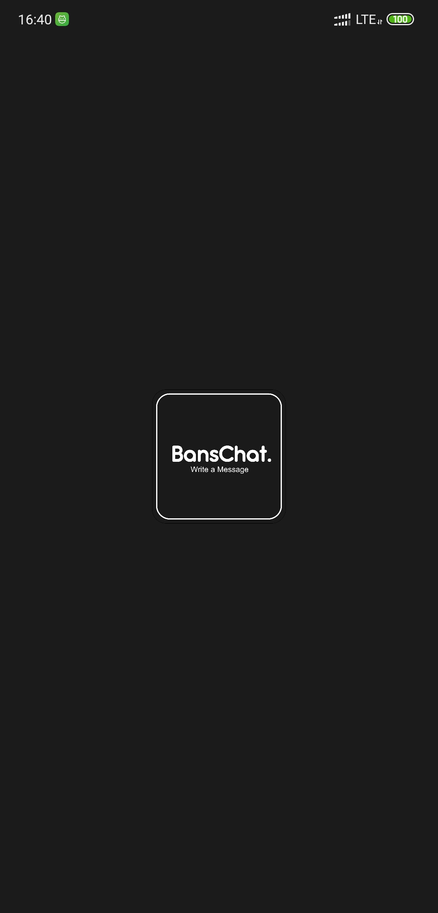
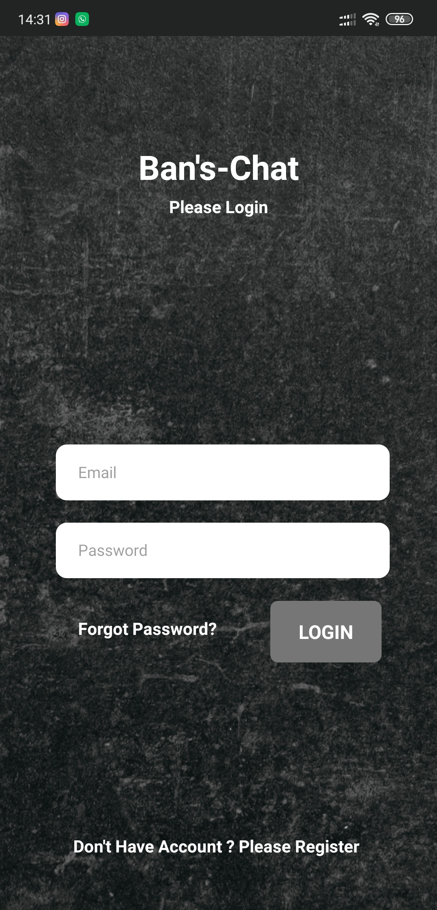
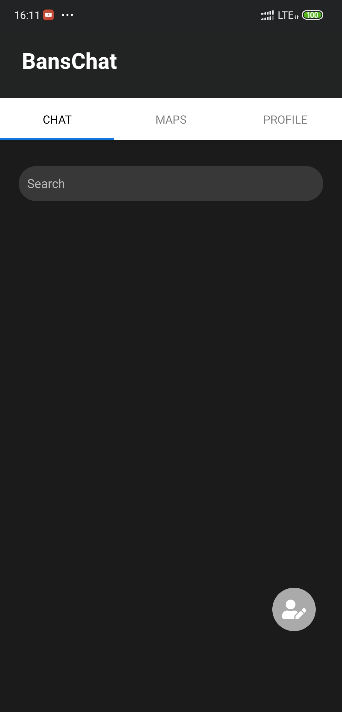
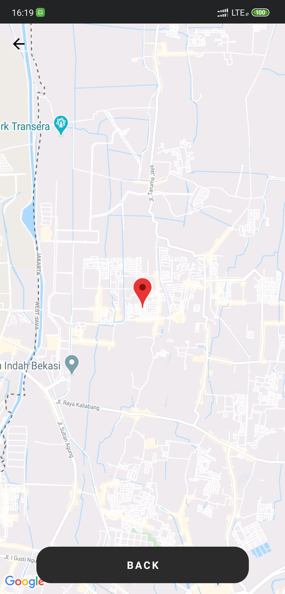
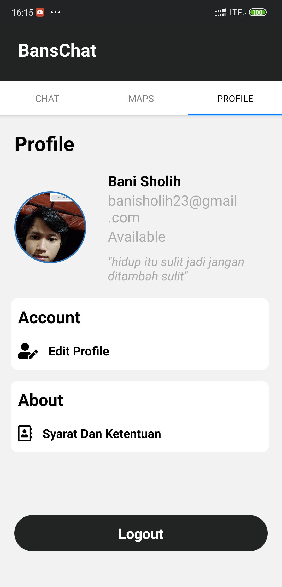
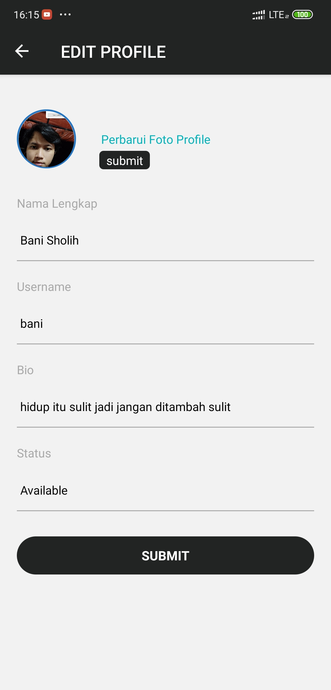

<h1 align="center">BansChat</h1>
<p align="center">
  
</p>
<p align="center">
  Build with React Native.
</p>


## Table of Contents

- [Introduction](#introduction)
- [Features](#features)
- [Requirements](#requirements)
- [Usage](#usage-for-development)
- [Screenshots](#screenshots)

## Introduction
<b>BansChat</b> makes it easy to find friends around and start chatting anytime with realtime location making it always connected with friends all over the world


## Features

* Realtime chat using firebase
* Show location of your friends
* Show list friend
* Show Profile

## Requirements
* [`yarn`](https://yarnpkg.com/getting-started/install) or [`npm`](https://www.npmjs.com/)
* [`react-native`](https://facebook.github.io/react-native/docs/getting-started)
* `Google maps API Key` you can get it [here](https://developers.google.com/maps/documentation/javascript/get-api-key)
* `Config realtime database firebase for WEB` you can get it [here](https://firebase.google.com/)
#### Example config
```

```
## Usage for development
1. Open your terminal or command prompt
2. Type `git clone https://github.com/banisholih23/bans-chattingApp.git`
3. Open the folder and type `yarn install or npm install` for install dependencies
4. Add your goole maps API Key on `AndroidManifest.xml`
##### Example
  ```
  <meta-data
        android:name="com.google.android.geo.API_KEY"
        android:value="YOUR_API_KEY"/>
  ```
6.  Type `react-native run-android` for run this app. ***Make sure your device is connected with debugging mode***.
7. done

## Screenshot 


<kbd>

</kbd>

<kbd>

</kbd>

<kbd>

</kbd>

<kbd>

</kbd>

<kbd>

</kbd>

<kbd>

</kbd>

<kbd>

</kbd>


